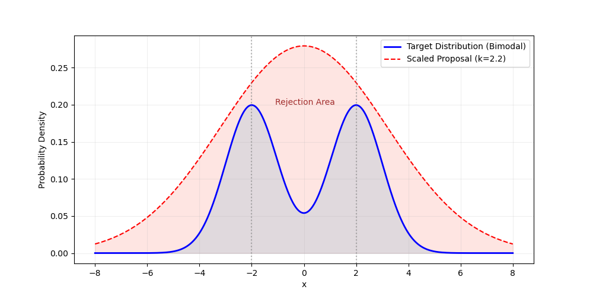
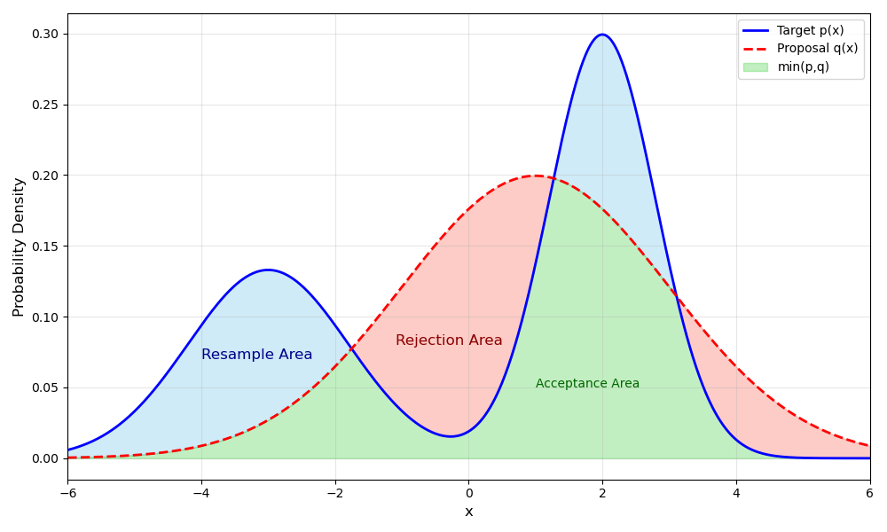

这两天看到ICLR 2025的一篇Oral做投机采样和级联模型结合，突然感觉以前拒绝采样的知识都很模糊了，于是有了这篇梳理拒绝采样的文章。

## 采样问题

经典的采样问题是说，我希望从某个空间中采样出一些$x$，其采样出来的概率服从一个分布$\pi(x)$。

举例来说，如果这个空间是像素空间，分布$\pi(x)$的概率密度聚集于猫狗照片，那么我们期望从中采样出来的$x$都是一些小猫小狗的照片；如果这个空间是句子空间，分布$\pi(x)$的概率密度聚集于一些中文语料，那么我们期望从中采样出来的$x$都是一些中文的句子。

对于一个简单的分布，我们可以用[change of variable规则](https://online.stat.psu.edu/stat414/lesson/22/22.2)，将均匀分布转换成目标分布。然而，这种方法对于无法积分或者甚至没有解析表达的分布而言是不可行的。对于这样的分布，我们假设我们对于任意$x$，可以计算其概率密度$\pi(x)$，希望能采样出一系列样本$\left\lbrace x_i\right\rbrace_{i=1}^N$，使得每个样本被采样到的概率$P\left(X=x_i\right)$等于其真实概率$\pi\left(x_i\right)$。

## 朴素的拒绝采样

朴素的拒绝采样的做法是给定一个提议分布 $q(x)$ ，将其乘上一个常数$k$以保证在任意 $x$ 处 $kq(x)\geq\pi(x)$ 。有了这个条件以后，我们按照这样的拒绝采样流程得到样本：

1. 从提议分布 $q(x)$ 中采样得到样本$x$，
2. 以概率 $\frac{\pi(x)}{k \cdot q(x)}$ 接受这个样本。

显然对于所有被接受的样本，其被采样的概率是正比与$\pi(x)$的。然而，如下图所示，所有红色部分都会被拒绝，因此朴素的拒绝采样的样本效率可能会较低，一个更紧的提议分布上界带来的拒绝率越低。

## 适应性拒绝采样

朴素的拒绝采样有可能连续出现样本被拒绝的情况。这在目标分布非常尖锐，提议分布无法很紧地包住它时常见（例如上图中2峰变为N峰，提议分布仍然使用高斯时）。适应性的拒绝采样可以有效提高采样效率，降低拒绝率。

适应性采样保证了不会出现连续被拒绝的样本。其核心思想是将采样的概率质量区域划分为三部分：

1. 拒绝区域 $q(x)>\pi(x)$ ，即下图的红色区域。
2. 接受区域 $\min(q(x), \pi(x))$ ，即下图的绿色区域。
3. 重采样区域 $\max(\pi(x) - q(x), 0)$ ，即下图的蓝色区域。

其中，对于属于重采样区域的样本$x$，其概率密度正比于 $\max(\pi(x) - q(x), 0)$ 。具体采样流程如下：

1. 从提议分布 $q(x)$ 中采样得到样本$x$，
2. 以概率 $\min\left(\frac{\pi(x)}{q(x)}, 1\right)$ 接受这个样本（即落在绿色区域即接受）。
3. 若拒绝了此样本$x$，从蓝色区域采样一个样本出来。

适应性拒绝采样可以保证两次采样必然能获得至少一个接受样本 。然而，重采样过程和从原分布采样是类似的，在无法积分的情况下不可行，但是在大语言模型的生成分布是多项分布，因此投机推理中适应性采样恰好合用。

细节推导

分情况讨论。

记第一次采样的样本为 $x$ ，若 $q(x) > \pi(x)$ ，且最终 $x$ 被接受，这时和经典拒绝采样等价。

若 $q(x) > \pi(x)$ 且最终 $x$ 被拒绝，这时会在 $S=\lbrace x | \pi(x) > q(x)\rbrace$区域采样，记此时采样的样本为 $x'$ 。则样本被采样到的概率质量 $P(X=x') = \frac{\pi(x) - q(x)}{Resample Area}$ , 最关键的部分是需要知道上图中蓝色部分和红色部分的概率面积是相等的，都等于 $1-\text{Acceptance Area}$ 。因此重采样到 $x'$ 的概率是 $\pi(x') - q(x')$。再加上一开始如果采样到 $S$ 时直接接受，概率为 $q(x')$，因此在 $S$ 区域的采样概率也为 $\pi(x)$ 。

## 在线采样

在线采样是一种在数据流或实时数据环境中进行数据采样的方法。与传统的离线采样不同，在线采样需要在数据到达时即时进行决策，以确定是否将该数据点包含在样本中。这里我们主要考虑蓄水池采样（reservoir sampling），即数据点源源不断，可能永远不会停止的情形。在任意时刻，要求采样出来的 $K$ 个样本都是无偏的，采样概率由分布 $\pi(x)$ 决定。

假设我们要采样 $K$ 个样本，记采样的样本构成的集合为 $S_t$ ，样本为 $x_t$，维护一个历史的所有样本的权重和 $W_t$。在线采样通过以下的流程保证采样过程服从 $\pi(x)$ ：

1. 若 $|S_t| < K$ ，$S_t = S_{t-1} \cup \lbrace x_t \rbrace$
2. 若 $|S_t| \geq K$ , 累加权重 $W_t=W_{t-1}+\pi(x_t)$
3. 以 $\frac{\pi(x)}{W_t}$ 的概率接受该样本并随机替换掉一个已采样的样本

简单证明

假设在 $t-1$ 时刻是无偏采样，对任意一个样本 $x_i$ ，其采样的概率都是 $\frac{\pi(x_i)}{W_{t-1}}$ ，那么在 $t$ 时刻，旧元素的保留概率为

$$
P(x_i \in S_t) = P(x_i \in S_{t-1}) \cdot \left[ 1 - \frac{\pi(x_i)}{W_t}\cdot \frac{1}{K} \cdot K \right] = \frac{\pi(x_i)}{W_{t-1}} \cdot \frac{W_t - \pi(x_i)}{W_t} = \frac{\pi(x_i)}{W_t}
$$

等于新元素被保留的概率，因此 $t$ 时刻也是无偏的采样。

## Metroplis采样

Metroplis采样是著名的MCMC采样中使用的方法。其核心思想是用局部的提议分布代替全局的提议分布，从而避免全局提议分布带来的低采样率。其成立的条件是ergodicity和detailed balance。前者不用多说，后者其实本质是一个充分条件，描述的是稳态时任意一个采样值 $x$ 的流出概率密度（从 $x$ 转移到其他状态的概率）等于其流入的概率密度。

Metropolis采样的具体流程如下：

1. 给定当前状态 $x_t$，从提议分布 $q(x|x_t)$ 中采样得到候选状态 $x'$
2. 以概率 $\min\left(1, \frac{\pi(x')q(x_t|x')}{\pi(x_t)q(x'|x_t)}\right)$ 接受候选状态，即 $x_{t+1} = x'$，否则保持当前状态 $x_{t+1} = x_t$

其中，$\pi(x)$ 是目标分布，$q(x|x_t)$ 是提议分布。如果提议分布是对称的，即 $q(x|x_t) = q(x_t|x)$，那么接受概率可以简化为 $\min\left(1, \frac{\pi(x')}{\pi(x_t)}\right)$。

Detailed Balance

Metroplis采样基于局部的稳态（detailed balance），要求从任意一个状态流出的概率质量等于流入该状态的概率质量。记当前状态为 $x_t$ ，转移到 $x'$ 的接收概率为 $\alpha(x'|x_t) = \min\left(1, \frac{\pi(x')q(x_t|x')}{\pi(x_t)q(x'|x_t)}\right)$ ，那么总有

$$
\pi(x_t)q(x'|x_t)\alpha(x'|x_t) = \pi(x')q(x_t|x')\alpha(x_t|x')
$$

原因是 $\alpha(x'|x_t)$ 和 $\alpha(x_t|x')$ 总是一个为1，另一个不为1。在这种情况下，假设在 $t$ 时刻已经达到了目标分布，即 $P(X_t=x)\pi(x)$ ，那么在 $t+1$ 时刻我们希望仍然保证是目标分布。

由于对于任意状态$x'$，其概率质量来自两部分：

- 从其他状态$x_t$转移过来的概率
- 保持在原状态的概率

因此有

$$
\begin{align}
P(X_{t+1}=x') &= \sum_{x_t}\pi(x_t)\cdot q(x'|x_t) \cdot \alpha(x'|x_t)
    + \pi(x')\cdot \left(\sum_{x_t}q(x_t|x')\cdot [1 - \alpha(x_t|x')]\right) \notag \\
&= \sum_{x_t}\pi(x')q(x_t|x')\alpha(x_t|x')
    + \pi(x')\sum_{x_t}q(x_t|x')
    - \pi(x')\sum_{x_t}q(x_t|x')\alpha(x_t|x') \notag \\
&= \pi(x') \notag

\end{align}
$$

## 投机推理

投机推理 （speculative inference）和Metroplis采样几乎相同，其中提议分布为一个小的语言模型。对于第一个被拒绝的样本，投机采样使用适应性拒绝采样，原因是两个语言模型的输出分布都是已知的Categorical分布。只需要找出所有大模型比小模型高的logits，非负截断并做归一化以后直接采样即可。
